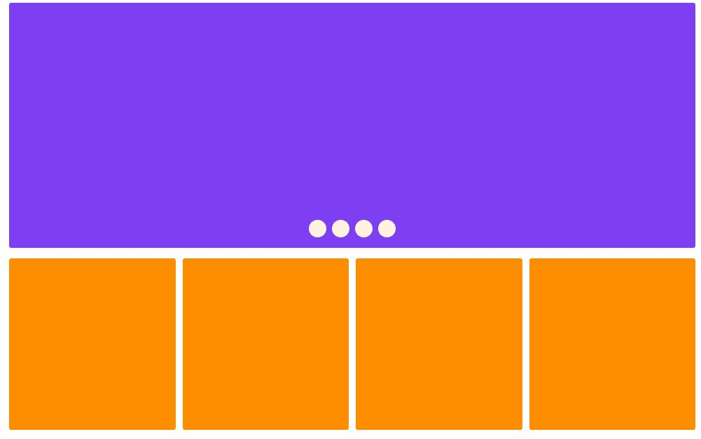

# HTML + CSS

1. **Largura**
- Retângulo - `980`
- Círculo - `25`
- Quadrado - `245`

2. **Altura**
- Retângulo - `350`
- Círculo - `25`
- Quadrado - `245`

3. **Cores**
- Retângulo - `#7e3ff2`
- Círculo - `#fff2df`
- Quadrado - `#ff8d00`

## Resultado
